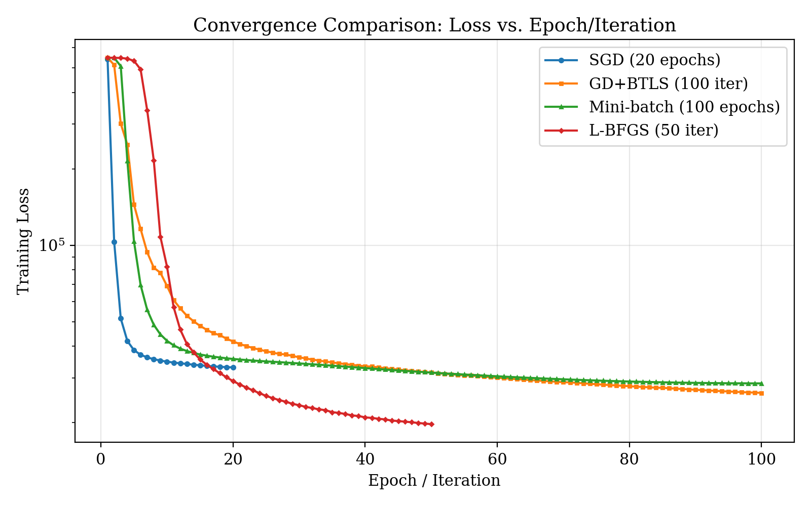
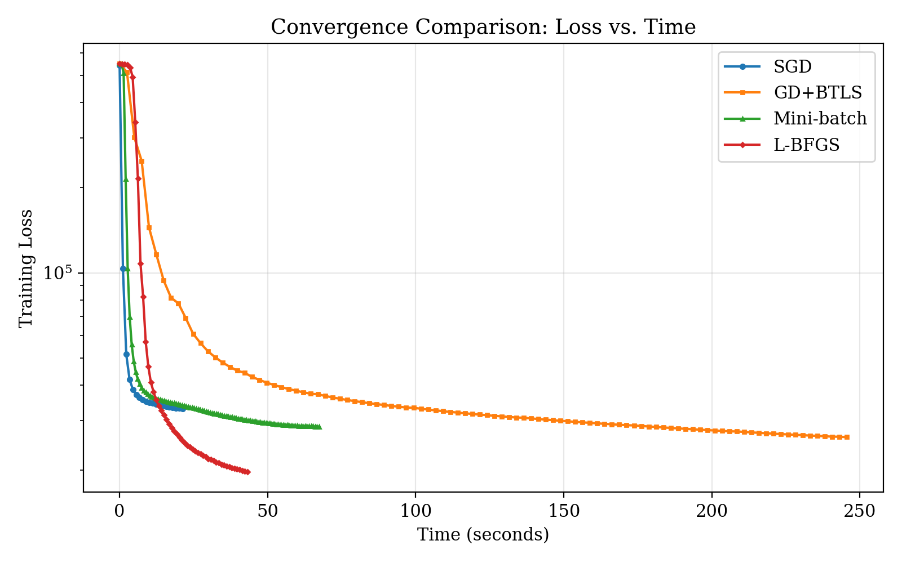

# Movie Recommendation via Matrix Factorization

A comparison of four optimization algorithms for collaborative filtering on the MovieLens 100K dataset. Course project for **ECE 503 — Optimization for Machine Learning** at the University of Victoria.

## Overview

This project formulates movie recommendation as a **matrix factorization** problem: the sparse user-movie rating matrix is approximated by the product of two low-rank latent factor matrices, $U \in \mathbb{R}^{m \times k}$ and $V \in \mathbb{R}^{n \times k}$, where $m$ users, $n$ movies, and $k = 10$ latent factors. The predicted rating for user $u$ on movie $i$ is $\hat{r}_{ui} = U_u^\top V_i$.

Four optimizers are implemented from scratch (with L-BFGS via SciPy) and benchmarked on the same objective:

- **Stochastic Gradient Descent (SGD)** — per-sample updates with linearly decaying learning rate
- **Gradient Descent with Backtracking Line Search (GD+BTLS)** — full-batch gradient with Armijo condition
- **Mini-Batch Gradient Descent** — batch-averaged gradient with normalized updates
- **L-BFGS** — limited-memory quasi-Newton method via `scipy.optimize.minimize`

## Problem Formulation

The training objective is the regularized squared-error loss:

$$L(U, V) = \frac{1}{2} \sum_{(u, i, r) \in \mathcal{R}} (r - U_u^\top V_i)^2 + \frac{\lambda}{2} \left( \|U\|_F^2 + \|V\|_F^2 \right)$$

where $\mathcal{R}$ is the set of observed (user, movie, rating) triples and $\lambda$ is the regularization strength. The gradients with respect to a single user/item factor row are:

$$\nabla_{U_u} L = -\sum_{i : (u,i,r) \in \mathcal{R}} (r - U_u^\top V_i)\, V_i + \lambda U_u$$

$$\nabla_{V_i} L = -\sum_{u : (u,i,r) \in \mathcal{R}} (r - U_u^\top V_i)\, U_u + \lambda V_i$$

## Dataset

[**MovieLens 100K**](https://grouplens.org/datasets/movielens/100k/) — 100,000 ratings (1–5) from 943 users on 1,682 movies, split 80/20 into train/test.

## Results

All optimizers were trained on the same 80% split and evaluated on the held-out 20%. Latent dimensionality $k = 10$, regularization $\lambda$ held fixed across optimizers.

| Optimizer       | Final Training Loss | Test RMSE  | Wall-Clock Time | Iterations    |
| --------------- | ------------------- | ---------- | --------------- | ------------- |
| SGD             | 33,033              | 0.9575     | **21.27 s**     | 20 epochs     |
| GD + BTLS       | 26,203              | 0.9374     | 245.63 s        | 100 iter      |
| Mini-Batch GD   | 28,570              | **0.9348** | 67.34 s         | 100 epochs    |
| L-BFGS          | **19,742**          | 1.0084     | 43.16 s         | 50 iter       |

### Convergence Comparison





The per-iteration plot is misleading on its own — one SGD epoch performs ~80,000 parameter updates while one GD+BTLS iteration performs only one. The wall-clock plot is the honest comparison and shows the practical Pareto frontier.

## Discussion

**L-BFGS achieved the lowest training loss but the worst test RMSE.** its test RMSE (1.0084) was the highest in the comparison. This is a clear case of **overfitting driven by optimizer efficiency**: L-BFGS takes very effective steps in the loss surface, but on this problem it converges into a sharp minimum that generalizes poorly. A higher $\lambda$ or early stopping based on a validation split would likely close this gap.

**Mini-Batch GD won test RMSE.** It strikes the best trade-off between gradient noise (which acts as implicit regularization) and convergence speed.

**SGD is the best speed/accuracy compromise.** Within ~21 seconds it reaches a test RMSE similar to the best optimizer (0.9575 to 0.9348), while the best method (Mini-Batch) takes more than 3× longer for marginal improvement.

**GD + BTLS is the slowest by a wide margin.** Each iteration requires evaluating the full gradient *and* the loss multiple times during line search. This guarantees descent but costs roughly 12× more wall-clock time than SGD for a 2% RMSE gain.

The takeaway: in practice, the choice of optimizer for matrix factorization should be guided by the time budget and the tolerance for hyperparameter tuning, not by which method achieves the lowest training loss.

## Project Structure

```
├── dataloader.py             # Load and 80/20 split MovieLens data
├── matrix_factorization.py   # MF model: predict, loss, gradients
├── optimizer.py              # SGD, GD+BTLS, Mini-Batch, L-BFGS
├── evaluation.py             # RMSE and learning-rate decay
├── main.py                   # Run all four experiments end-to-end
├── generate_plot.py          # Convergence plots
└── u.data                    # MovieLens 100K ratings
```

## Usage

```bash
pip install -r requirements.txt
python main.py
```

This runs all four optimizers on the same train/test split and prints loss curves, final test RMSE, and wall-clock time for each.

## Requirements

- Python 3.9+
- NumPy
- SciPy
- Matplotlib

## References

- Koren, Y., Bell, R., & Volinsky, C. (2009). *Matrix Factorization Techniques for Recommender Systems*. IEEE Computer.
- Nocedal, J., & Wright, S. (2006). *Numerical Optimization* (2nd ed.). Springer. — for BTLS (Armijo) and L-BFGS background.